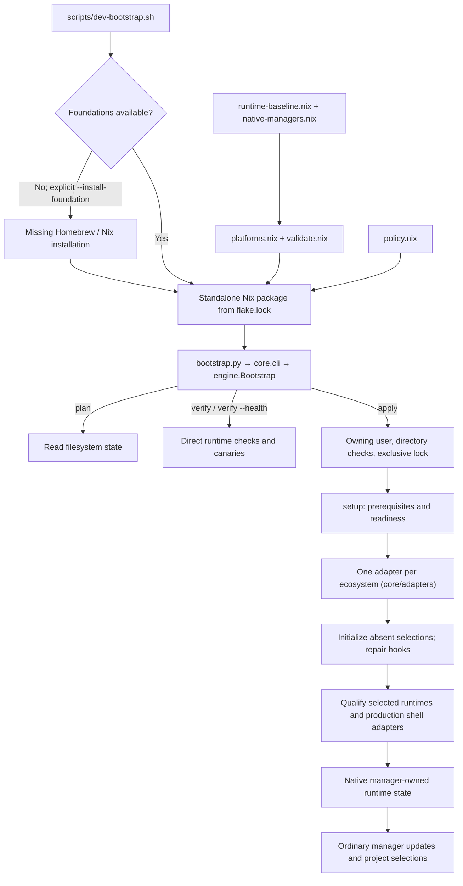

# Development Bootstrap

Bootstrap establishes a declared initial environment. Ecosystem managers own
subsequent upgrades, additional releases, defaults and project selection. A
rerun repairs missing baseline entries without reverting that evolution.
Exact baseline verification and selected-environment health are separate
operations. Neither substitutes for project dependency locks.

`scripts/dev-bootstrap.sh` is the pre-Nix workstation entry. It acquires missing
macOS foundations only with `--install-foundation`, then invokes this packaged
executor. Its `--check-foundation` mode avoids downloads, Nix realization and
runtime installation. The executor remains responsible for native prerequisites
and runtime semantics; the entry does not reproduce those decisions in Bash.

Initial seeding, recovery of subsequently evolved state and project dependency
reconstruction have separate acceptance criteria. Prefer native exports/locks
for the latter two. Adapters use the manager's supported installation interface
against its own upstream: the bootstrap declares exact versions, not artifacts.
All fifteen adapters follow this model, Node through `fnm install` and Python
through `pyenv install`.

## Architecture and Execution

The standalone entry reads the public nixpkgs revision from `flake.lock`
through `scripts/development-bootstrap.nix`. It does not evaluate unrelated
application inputs in the root flake, keeping toolchain setup independent of
their access requirements and evaluation. The same expression supplies
the bootstrap package used by CI. `--impure` permits reading the local locked
expression and host system; it does not update the lock or select a channel.



| Component | Responsibility |
| --- | --- |
| `package.nix`, `policy.nix` | Compose the manifest and literal argv policy, package the executor and run fixture checks. |
| `bootstrap.py`, `core/cli.py` | Stable executable entry, argument parsing, reporting and process exit status. |
| `core/manifest.py` | Validate the generated manifest; each toolchain adapter validates its own declaration. |
| `core/process.py`, `paths.py`, `errors.py` | The single process boundary with scoped child environments; writable roots and owned directories; operational errors. |
| `core/engine.py` | Resolve the selection from the adapters' metadata, report the catalog, inspect and verify runtimes, serialize mutation and dispatch installation. |
| `core/setup.py` | Run the setup stages over the selected adapters: prerequisites, readiness, defaults, hooks, selection reports and shell qualification. |
| `core/adapters/base.py` | The adapter contract and the behavior every ecosystem shares: planning, manager resolution, verification and selection reports. |
| `adapters/node.py`, `python.py`, `ocaml.py` | Install Node through FNM from nodejs.org into a staging root, build CPython with the native pyenv's python-build, adopt an opam switch already holding a declared compiler or create one from the root's own upstream repositories. |
| `adapters/toolchain.py` and one module per manager | rustup, GHCup, elan, rbenv, SDKMAN, Coursier and juliaup: hashed installer acquisition, native installation, absence-only defaults and direct canaries. |
| `adapters/sdkman.py` | The shared SDKMAN base: Java (`jvm.py`), then Kotlin, Maven and Gradle, which require `jvm` and run on its JDK. |
| `adapters/coursier.py` | Scala through the pinned native `cs` launcher. The seed is the Scala distribution in Coursier's archive cache, filled from a discarded staging directory; the `scala` and `scalac` launchers are created only when absent. Requires `jvm` and runs on its JDK. |
| `adapters/dotnet.py` | The .NET SDK through the hash-checked `dotnet-install` script, which is also its acquisition: no version manager, no global selection, the muxer in `DOTNET_ROOT` and projects' `global.json`. |
| `adapters/conda.py` | Conda through the hash-verified Miniforge3 installer in batch mode, which installs the base environment as the manager's acquisition. Selected only by `--only conda`; `conda init` never runs. |

From the repository root:

```sh
bash scripts/dev-bootstrap.sh --check-foundation
bash scripts/dev-bootstrap.sh plan --json
bash scripts/dev-bootstrap.sh apply --only rust
bash scripts/dev-bootstrap.sh verify --health --only rust
```

## Selection

Each adapter declares four selection fields in its class, which the engine
enforces and every JSON report lists under `catalog`, selected or not:

| Field | Meaning | Enforcement |
| --- | --- | --- |
| `requires` | Ecosystems that must be selected in the same run (Kotlin, Maven, Gradle and Scala require `jvm`) | An explicit `--only` without them fails and names the missing `--only` options; it is never widened silently. |
| `default_selected` | Whether a run without `--only` includes the ecosystem (Conda does not) | An optional ecosystem is reached only through `--only`; an implicit `plan` neither selects nor reports it, and the catalog lists it as available and not selected. |
| `platforms` | Where the adapter is available | Unavailable adapters are left out of an implicit selection, and an explicit one fails. |
| `consents` | Terms an apply must name with `--accept` | `apply` stops before any lock, package or installer until each selected adapter's terms are accepted. |

The selection runs in registry order, which lists every requirement before
its dependents, so installation needs no separate dependency resolution. A
frontend reads the catalog instead of duplicating this metadata.

An installed `dev-bootstrap` accepts the same runtime arguments; `devrestore`
is a compatibility alias to that executable. `--runtimes-only` skips prerequisite,
default and shell setup but retains mutation guards and locking. `plan` reads
state without launching managers. `verify` checks exact baseline identities
and the baseline's complete build canaries. `verify --health` checks that each
global selection runs, at any release and without changing it; there is no
version floor. A selection the manager delegates to the host (`system` for
pyenv and rbenv, `fnm default system`) is reported as `external` and not
executed, because the host PATH decides which runtime it is. Health loads
every extension that links a host library (Python's `ssl`, `sqlite3`,
`ctypes`, `readline`, `lzma`, `bz2` and `zlib`; Ruby's OpenSSL, zlib and
Psych), so a native library upgrade that breaks a compiled runtime surfaces
as a `conflict`. A conflicting runtime compiled against host libraries
(Python, Ruby, an opam switch) also carries `remediation`, the manager command
that rebuilds it, which is reported and never run. `apply` reports
global selections under `selections` instead of failing on them: they belong
to the native managers. The fresh-shell check covers verified selections only.
Verification runs executables and temporary canaries, so it is not a filesystem-
only inspection. JSON reports go to stdout and operational errors to stderr;
exit codes are 0 for success, 1 for unsuccessful verification, and 2 for invalid
arguments or operational failures.

## Common Boundaries

Nix declares initial identities, platform prerequisites, installer arguments
and manager CLI floors. Package evaluation and builds never initialize a real
manager root. The explicit executor owns locking, prerequisite checks, additive
installation, absence-only defaults, health checks and shell qualification.
Source builds and network installation remain outside activation and shell
startup.

Each adapter's `manager()` is the single native-manager resolver for setup,
runtime installation and shell expectations. Existing supported pyenv
checkouts take precedence over host packages, matching production Zsh. FNM's
local exposure must agree with its canonical executable; readiness rejects a
conflicting link. Do not independently discover the same manager through PATH
inside a new adapter. Manifests without setup retain the standalone runtime
interface's PATH discovery.

`run(..., source_build=True)` starts from an allowlist of account, temporary,
PATH, proxy and certificate variables. Compiler, SDK, flags and package-search
settings must come from the platform's `buildEnvironment`, not a project
shell. SDK probing uses the same policy. Ordinary manager commands retain
their existing environment filtering. Absolute manager paths avoid
process-global PATH changes. An intentional SDK override belongs in the
declaration; inherited `SDKROOT` and `DEVELOPER_DIR` are not build inputs.

Mutable roots, caches and locks remain outside the repository and store.
Installation is additive. Incomplete prefixes are reported for inspection,
never automatically deleted or overwritten. Defaults are initialized only
when absent; malformed existing selectors are errors. Resumable journals
belong only to operations whose manager semantics require multiple stages.

The repository, generated manifest and native manager installations are trusted
code inputs. `--manifest` is not a sandbox for third-party recipes: the manifest
contains executable paths, command arguments and installer policies. Version
validation and literal argv prevent accidental interpretation of identifiers;
they cannot make an arbitrary recipe safe. Project files and inherited build
settings are excluded from bootstrap command construction.

Homebrew exits 1 when it installs a formula but cannot link it over a file
that another formula owns, for example an old `openssl@1.1`. Setup then
queries the package manager again and fails only if a requested package is
still missing. Build prerequisites are used through their opt prefixes, and
readiness still checks every manager executable.

A failed command's error carries the last 2,000 characters of stderr and of
stdout, since some tools report the cause on stdout.

SDKMAN's installer and every `sdk` call run under the package's own Bash
(`sdkmanShell`), because SDKMAN 5.23 requires Bash 4 and macOS ships 3.2.
SDKMAN still installs from its own upstream; only the driver shell is Nix's,
as the shell probe's zsh is.

Every normal apply route rejects execution as root and checks selected mutable
roots and runtime containers before invoking installers. Symlinked containers
and group/world-writable state are rejected. Only declared native package-manager
operations request elevation; the Python executor remains under the owning
account. The bootstrap lock serializes its own invocations, not simultaneous
manual manager operations. Avoid running upgrades concurrently with bootstrap.

## Extending an Ecosystem

Introduce one bounded integration at a time. An ecosystem is one subclass of
`adapters.base.Adapter`, registered in `adapters/__init__.py`; the engine and
setup stages call only that interface and never branch on a language. A
manager that installs exact toolchains into its own root extends
`ToolchainAdapter` and supplies data and small hooks: roots, binary paths,
install and default arguments, and a canary. Additional components of an
existing ecosystem (Cabal and HLS beside GHC) stay inside that ecosystem's
adapter. A separate tool that runs on another ecosystem (Kotlin on the JDK)
gets its own adapter and declares that ecosystem in `requires`.

Each integration must identify:

1. **Acquisition:** native manager origin on each host, exact initial runtime
   and build-input identities, checksums, and artifact retention. Moving tags
   such as `stable`, `recommended`, or `release` may describe updates; they
   do not identify an immutable initial baseline.
2. **Inspection:** manager root, installed identity, incomplete state, global
   selection and project selectors. Planning never invokes installers or
   implicitly downloads a toolchain.
3. **Installation and recovery:** literal arguments, scoped environment,
   prerequisites, failure behavior and retry. Repository/channel semantics
   remain explicit where they differ between managers.
4. **Selection and health:** absence-only defaults, project precedence,
   independent identity checks and a small executable/compilation canary.
   Exact verification must not reset updated defaults.
5. **Lifecycle:** an ordinary manager upgrade or additional-version operation,
   followed by a preserving bootstrap rerun. Metadata refresh alone does not
   qualify a runtime or manager upgrade.

Rust, Haskell, Lean, Ruby, JVM, Kotlin, Maven, Gradle, Scala, Julia, .NET and
Conda are implemented in `core/adapters/` and selected with the corresponding `--only`
value. Their initial versions are declared in `runtime-baseline.nix`. These
integrations use native manager installation interfaces instead of duplicating
their download/extraction logic. Existing runtime health and fixture checks do
not establish fresh-install acceptance for these routes.

The broader workstation registry contains 34 logical domains: twelve native
bootstrap domains, ten existing shared Nix declarations and twelve
remaining cross-platform setup domains. The native domains include HLS within
Haskell, and Kotlin, Maven and Gradle within the JVM. The remaining domains are
Ada, Fortran, Free Pascal, Mojo, Lua, Perl, PHP, MIT Scheme, Racket, Android,
Flutter and Swift. These counts describe implementation coverage, not
clean-host or complete native-dependency reproducibility.

| Ecosystem / owner | Initial declaration | Distinct behavior to qualify |
| --- | --- | --- |
| Rust / rustup | Exact host toolchain with the native default profile | Preserve directory overrides and `rust-toolchain.toml`; check proxy exposure and a compiled program. Extra targets/components require explicit future declarations. [Override semantics](https://rust-lang.github.io/rustup/overrides.html). |
| Haskell / GHCup | Exact GHC, Cabal and HLS identities | Installation and selection are distinct. Preserve project compiler choices. Each HLS release ships servers for a fixed set of GHC releases; the declared one must be listed in GHCup's default metadata channel, which a fresh GHCup reads, and must include the declared GHC, whose server the canary starts with `GHC_BIN` naming that GHC, so the bindist launcher also checks its boot-package ABI. [GHCup guide](https://www.haskell.org/ghcup/guide/). |
| Lean / elan | Exact Lean toolchain identity and artifact | Respect `lean-toolchain`; qualify Lean and Lake without changing project selection. [elan](https://github.com/leanprover/elan). |
| Ruby / rbenv | Exact Ruby release through native ruby-build and declared native libraries | Reuse source-build isolation, preserve `.ruby-version`, and verify shims/extensions. Ruby-build and native libraries are rolling prerequisites, not retained immutable build inputs. [rbenv](https://github.com/rbenv/rbenv). |
| JVM / SDKMAN | Explicit candidate/version/vendor identity for the chosen JDK | Use a controlled shell adapter with literal arguments for `sdk`. Preserve current candidates and `.sdkmanrc`; qualify noninteractive installation and default prompts. [SDKMAN usage](https://sdkman.io/usage/). |
| Kotlin, Maven, Gradle / SDKMAN | Exact candidate versions, each its own adapter requiring `jvm` | Run on the declared JDK through `JAVA_HOME` (the selected one when the declared JDK is absent). Canaries compile and run a Kotlin program, start Maven's core and check it reports that JDK, and run an offline Gradle task without a daemon. `MAVEN_SKIP_RC` keeps `~/.mavenrc` out, and Gradle uses scratch user homes. |
| Scala / Coursier | Exact Scala 3 release through the pinned native `cs` launcher | `cs install` into a staging directory extracts the prebuilt distribution into the archive cache without replacing the user's launchers, which are the global selection. Health resolves the `scala` launcher to the distribution it runs and never executes a JVM bootstrap launcher, which may download on start. The canary compiles with the distribution's `scalac` and runs the class on the declared JDK. Project selections (`build.sbt`, Scala CLI directives) are untouched. [Coursier install](https://get-coursier.io/docs/cli-install). |
| .NET / dotnet-install | Exact SDK release, installed side by side into `DOTNET_ROOT` | No version manager: the script installs one SDK per run with `--skip-non-versioned-files`, keeping a newer muxer, and readiness lists SDKs, so a runtime-only root gets the SDK beside it. The muxer runs the newest SDK unless a project's `global.json` pins one, so there is no global selection; exact verification pins the declared SDK with a scratch `global.json`, and health runs the muxer unpinned. The canary builds and runs a console program with no package source, so it cannot download. Every call disables telemetry and keeps CLI and NuGet state in scratch directories. [dotnet-install](https://learn.microsoft.com/dotnet/core/tools/dotnet-install-script). |
| Conda / Miniforge3 | Exact conda release through the matching Miniforge3 installer, a per-platform release asset | Default-off. The batch installer creates `CONDA_ROOT_PREFIX` with conda and its base environment, so acquisition is the installation and a prefix without its interpreter is a conflict to inspect. Identity is the conda release reported by the base interpreter, which also runs the canary; the conda CLI, which can reach the network, never runs during verification. `conda update` evolves the base in place, so exact verification describes the initial seed only, and health covers the evolved base. Existing environments and `.condarc` are untouched. [Miniforge](https://github.com/conda-forge/miniforge). |
| Julia / juliaup | Exact initial version/channel mapping and artifacts | Preserve evolving defaults and directory overrides. Qualify version selection and project activation separately from package restoration. [juliaup](https://github.com/JuliaLang/juliaup). |

Native macOS and CachyOS routes require separate qualification. NixOS needs
an explicit target and runtime strategy; a Linux platform string is
insufficient. A native package name does not lock its future binary or
dependency closure.

Official manager installer scripts are hash-checked before execution; a changed
upstream script fails closed until its declaration is reviewed. A script from a
mutable endpoint must stay below 1 MiB. A larger installer is a versioned
release asset declared per platform with its exact size, which also bounds the
download; it is streamed to disk and runs, or is placed, only once its size and
digest match. A `gzip` asset is unpacked after verification. These hashes do
not pin every payload downloaded by the upstream installer. FNM does not verify
Node's published checksums, so Node's integrity rests on HTTPS to nodejs.org,
which the policy names explicitly; python-build verifies the checksums embedded
in its definitions. `dotnet-install` checks only that the SDK archive's size
matches the server's, so the SDK's integrity likewise rests on HTTPS to
Microsoft's download host. Manager acquisition
and exact runtime installation require network availability. The new adapters
provide reproducible initial version intent, not an offline archive or identical
native binary builds. Juliaup's official installer also installs the declared
initial Julia channel; recovery with an existing Julia selection and a missing
manager stops for inspection rather than risking a default replacement.

Rust/Lean/Julia and SDKMAN shell probes check proxy provenance and filesystem-selected
runtime identities without invoking download-capable proxies. Direct runtime
canaries establish execution separately; project override dispatch and deployed
login-shell behavior remain native acceptance checks.

## CI and Native Qualification

`.github/workflows/development-bootstrap.yml` runs source contracts and the Nix
package's tests on Linux x86_64 and macOS ARM. Reproduce its two stages with:

```sh
bash scripts/ci-development-bootstrap.sh source
bash scripts/ci-development-bootstrap.sh package
```

Source tests need Python 3.13 or newer and a writable temporary directory outside
the checkout. Package tests use locked public nixpkgs independently of other
flake inputs. The Nix/Zsh workflow runs policy checks and complete configuration
evaluation on pushes and pull requests. StatWell is public; no deploy key or
repository-specific credential is required by these checks.
Neither workflow installs native compilers or activates a workstation.

`.github/workflows/development-bootstrap-native.yml` is dispatched manually. It
builds the package and runs `tests/qualification/native-adapters.zsh` for the
selected ecosystems on a macOS runner and in an Arch container, with real
managers, downloads and builds. Its input lists jobs separated by commas, each
a space-separated list of ecosystems run in one disposable root. The default
covers every adapter in five jobs per platform, with CPython, the OCaml
compilers and GHC each in a job of their own. The container runs the executor
as an unprivileged account whose passwordless `sudo` covers only pacman.
Acceptance of a complete CachyOS workstation takes place outside CI.

## Test Model

The [test guide](tests/README.md) describes category selection and fixture
boundaries.

Parameterize variations of the same observable contract, keeping distinct
state transitions separate. Use `unittest.subTest` for manager routes, exit
statuses and build-environment modes, and small shell tables for adapter
variants. Failures must identify the parameters.

| Layer | Evidence | Boundary |
| --- | --- | --- |
| Shared orchestration | Empty state, rerun, evolved selections, prerequisite failure, lock, interruption | Deterministic filesystem fixtures; mock external process boundaries. |
| Adapter contract | Invocation, manager-specific transition, effective child environment | Call production installation paths; do not assert values supplied directly by the test itself. |
| Production shell | Executable/manager origin, project/default preservation | Execute actual adapters with isolated managers; assert mock provenance. |
| Native qualification | Real CLI, artifacts, compiler canaries and ordinary upgrades | Separate expensive/networked tests; empty switches cannot establish compiler acceptance. |
| Clean/deployed host | OS prerequisites, setup entry, actual interactive startup and rerun | A disposable HOME or successful Nix build does not close this gate. |

For corrections, temporarily reintroduce the defect and verify that the
relevant test fails. Use this bounded mutation check for concrete coverage
questions, without a permanent mutation framework or equivalent happy paths.
Alias identity plus one packaged smoke test is sufficient. Historical
migration comparisons are not routine tests. Keep legacy-state recovery tests
while those states remain supported.
